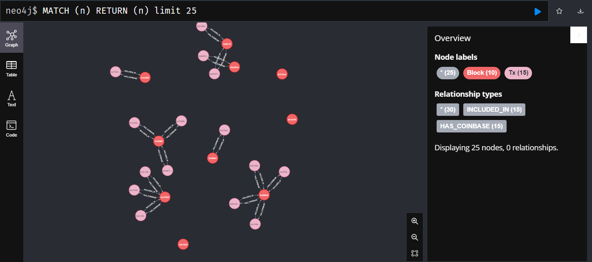

# Trying to create something fun from raw blochain data ;)

## 🚧 Project under construction

## Goals

- Create ETL pipeline loading raw blockchain data to graph database
- Use both batch and streaming processing (Kafka)
- Retrieve meaningful statistcs due to fancy graph algorithms
- Try some ML algorithms and compare results with the ones from graphs

## Roadmap

- ✅ Load some raw data from Ethereum blockchain to graph database
- 🚧 Add Kafka streaming to load new data in real time
- 🚧 Migrate to cloud (eg. Databricks)
- 🚧 Choose and apply graph algorithms on clean data

## Current state of the project

- To run main.py script the local Spark cluster is required
- Script loads n latest blocks data from Infura Ethereum node to Neo4j database
- Project includes Zeppelin setup but it's currently unused
- Code needs refactor
- EthereumService is based on Pandas Dataframes and EthereumServiceSpark on PySpark Dataframes

### Neo4j nodes

#### Block

Block node has for now general info of the Ethereum block and has the relation INCLUDED_IN with transactions .

#### Transcation

Transactions data is retrieved from blocks details and has the relation HAS_COINBASE with blocks.

#### Account

Accounts are retrieved from the transactions info. It is specified if the account is private address or smart contract.

Example results of running Cypher query on the loaded blockchain data.

